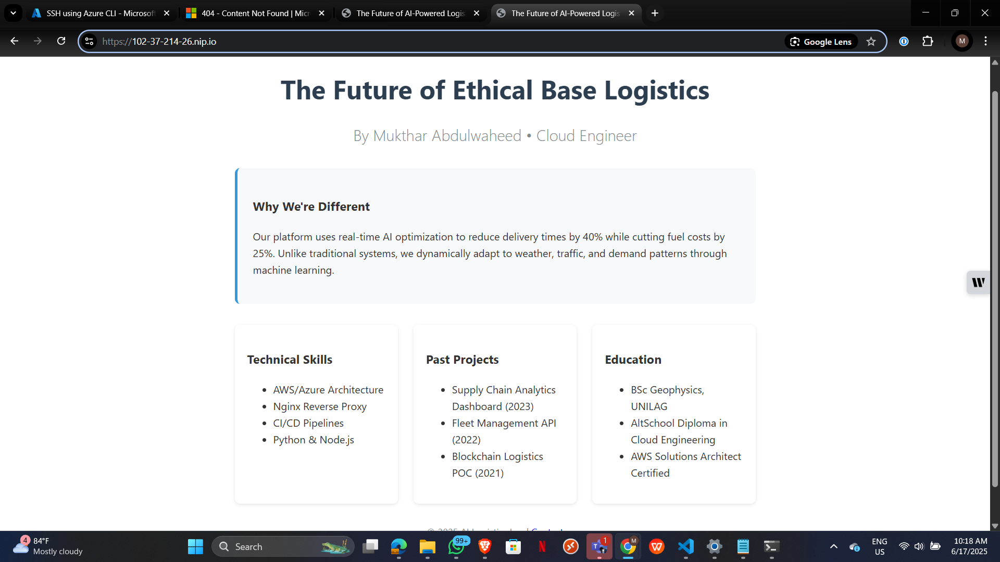

# AltSchool Cloud Project
`By Mukthar Abdulwahhed`
## Deployment Steps
1. **Provisioned Azure VM** (Ubuntu 24.04)
   - Created free tier account at portal.azure.com
   - Verified student credentials
   - Launched Ubuntu 24.04 LTS
   - Instance Type: Standard_B1s (Free Tier)
   - Generated SSH key pair (`altschoolProject_key.pem`)
   - Stored private key securely on local machine
   - Security Group Rules:
     - Allow SSH (Port 22)
     - Allow HTTP (Port 80)
     - Allow HTTPS (Port 443)
   - Assigned static public IP: 102.37.214.26
     
2. **Configured Nginx**:
   - #### System update and Nginx installation
      - sudo apt update && sudo apt upgrade -y
      - sudo apt install nginx -y
   - #### Service management
      - sudo systemctl start nginx
      - sudo systemctl enable nginx
   - #### Custom landing page with CSS animations & HTML Development
      - sudo nano /var/www/html/index.html
   - #### File Permission
      - sudo chmod 644 /var/www/html/index.html
      - sudo chown www-data:www-data /var/www/html/index.html
      - HTTPS implementation and encrypt SSL (Certbot)
        
3. **Security**:
   - Restricted file permissions (chmod 644)
   - Enabled UFW firewall
   - sudo ufw allow 'Nginx Full'
   - sudo ufw allow 'OpenSSH'
   - sudo ufw enable

## Access
- **Public IP:** 102.37.214.26
- **HTTPS:** https://102-37-214-26.nip.io

